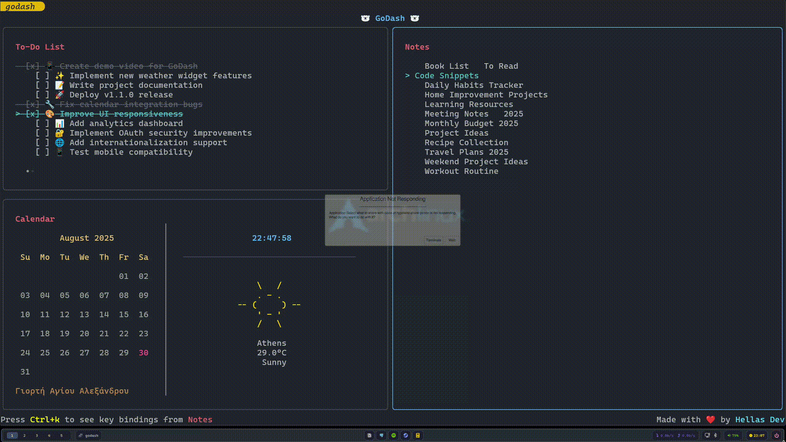

<div align="center">

# Your Terminal Personal Productivity Dashboard


[](https://golang.org/)
[](https://github.com/charmbracelet/bubbletea)
[](LICENSE)
[](#platform-support)
[](https://github.com/sponsors/HellasDev)
[](https://github.com/HellasDev/GoDash/releases)

_A sleek, all-in-one personal productivity dashboard that runs directly in your terminal_

</div>

---

<div align="center">

### ⭐ Star this project if you find it useful!

[](https://github.com/HellasDev/GoDash)

</div>

---

## 📹 Demo



### 🎥 [Watch High-Quality Video Version](./assets/godash_trimmed.webm)

*Click above to watch GoDash in action - managing todos, notes, calendar, and weather in one unified terminal dashboard*

---

## 🌟 Overview

GoDash is a modern terminal-based productivity dashboard built with Go and the powerful Charm ecosystem. It seamlessly combines task management, note-taking, calendar integration, and weather updates into a single, beautiful, and responsive TUI (Text-based User Interface).


---

## ✨ Features

### 🎯 **Unified Dashboard**

- **Three-Panel Layout**: Todo list, notes manager, and calendar view
- **Focus System**: Switch between panels using mouse clicks or keyboard navigation
- **Responsive Design**: Automatically adapts to your terminal size

### ✅ **Task Management**

- Create, edit, delete, and toggle tasks
- Persistent storage with automatic saving
- Intuitive keyboard shortcuts

### 📝 **Notes Manager**

- **Markdown Support**: Full Markdown rendering and editing
- **Dual Mode Editor**: Switch between preview and source modes
- **Save Confirmation**: Visual feedback when notes are saved
- **Unsaved Changes Protection**: Warning dialog before discarding changes
- **File-based Storage**: Notes saved as individual `.md` files

### 📅 **Google Calendar Integration**

- **OAuth 2.0 Authentication**: Secure login with production-ready flow
- **Automatic & Manual Flow**: Tries local callback server, falls back gracefully
- **Daily View**: See today's events at a glance
- **Calendar Navigation**: Browse different dates and months
- **Browser Integration**: Quick access to full Google Calendar

### 🌤️ **Weather & Clock**

- **Real-time Weather**: Current conditions for your location
- **wttr.in Integration**: No API key required, reliable weather data
- **Live Clock**: Always-current time display

### 🎨 **Modern UI**

- **One Dark Theme**: Easy on the eyes with professional colors
- **Polar Bear Branding**: Cute mascot and consistent theming
- **Smooth Animations**: Polished user experience
- **Status Messages**: Clear feedback for all actions

---

## 🚀 Quick Start

### Installation & Launch

**Professional terminal productivity dashboard - ready in seconds!**

#### 🏛️ Arch Linux (Recommended)

```bash
# Install with full desktop integration
yay -S godash

# Launch from application menu or terminal
godash
```
*✨ Appears automatically in your application menu (Rofi, GNOME, KDE, etc.) with professional icon*

#### 🚀 Other Linux Distributions

**See available downloads and installation instructions in [Releases](https://github.com/HellasDev/GoDash/releases/latest)**
- AppImage (Universal - works on all Linux distributions)
- Traditional binaries (x86_64)  
- ARM64 binaries (Raspberry Pi, ARM devices)

### 🎯 First Launch

**Two simple steps to full productivity:**

1. **🌤️ Weather**: Enter your city (e.g., "Athens", "New York")
2. **📅 Calendar**: One-click Google OAuth authentication

**That's it!** Your complete productivity dashboard is ready.

---

## ⚙️ How It Works

**Zero configuration required** - GoDash handles everything automatically:

### 🌤️ Weather
- Uses wttr.in service (no API key needed)
- Simply enter your city name once
- Automatic updates and caching

### 📅 Google Calendar  
- **Automatic OAuth Flow**: Opens browser and handles authentication seamlessly
- **Manual Fallback**: Copy/paste option if needed
- **Secure**: Tokens stored locally, credentials embedded safely
- **Production Ready**: Works reliably across all environments

---

## ⌨️ Keyboard Controls

### Global Controls

| Key      | Action                      |
| -------- | --------------------------- |
| `Tab`    | Cycle focus between panels  |
| `Ctrl+K` | Show help for current panel |
| `Ctrl+Q` | Quit application            |

### 📋 Todo List Panel

| Key       | Action                   |
| --------- | ------------------------ |
| `o`       | Add new task             |
| `i`       | Edit selected task       |
| `Ctrl+D`  | Delete selected task     |
| `Space`   | Toggle task completion   |
| `↑` / `↓` | Navigate tasks           |
| `Enter`   | Confirm add/edit         |
| `Esc`     | Cancel add/edit          |
| `Ctrl+S`  | Save task (when editing) |

### 📝 Notes Panel

| Key       | Action               |
| --------- | -------------------- |
| `o`       | Create new note      |
| `e`       | Edit selected note   |
| `Ctrl+D`  | Delete selected note |
| `↑` / `↓` | Navigate notes       |
| `Enter`   | Open note in editor  |

#### Note Editor Controls

| Key      | Action                                        |
| -------- | --------------------------------------------- |
| `i`      | Toggle between preview and edit mode          |
| `Ctrl+S` | Save note (shows confirmation)                |
| `Esc`    | Exit editor (with unsaved changes protection) |

**Note Editor Behavior:**

- **Edit Mode**: Type freely, `i` key works normally for text input
- **Preview Mode**: Press `i` to enter edit mode
- **Unsaved Changes**: ESC from edit mode shows confirmation dialog if changes exist

### 📅 Calendar Panel

| Key                   | Action                          |
| --------------------- | ------------------------------- |
| `↑` / `↓` / `←` / `→` | Navigate calendar dates         |
| `Enter`               | Open Google Calendar in browser |
| `Ctrl+O`              | Authorize/re-authorize calendar |

---

## 💾 Data Storage

GoDash follows platform conventions for data storage:

### Linux

- **Configuration**: `~/.config/GoDash/config.json`
- **Notes**: `~/.local/share/GoDash/notes/*.md`
- **Tasks**: `~/.local/share/GoDash/todo-list.json`
- **Calendar Cache**: `~/.local/share/GoDash/calendar_cache.json`
- **OAuth Tokens**: `~/.config/GoDash/token.json`

### macOS

- **Configuration**: `~/Library/Application Support/GoDash/config.json`
- **Data**: `~/Library/Application Support/GoDash/`
- **Cache**: `~/Library/Caches/GoDash/`

All data remains local and private to your machine.

---

## 🛠️ Technical Details

### Built With

- **[Go](https://golang.org/)** - Systems programming language
- **[Bubble Tea](https://github.com/charmbracelet/bubbletea)** - TUI framework
- **[Lipgloss](https://github.com/charmbracelet/lipgloss)** - Terminal styling
- **[Bubbles](https://github.com/charmbracelet/bubbles)** - TUI components
- **[Glamour](https://github.com/charmbracelet/glamour)** - Markdown rendering
- **[Google Calendar API](https://developers.google.com/calendar)** - Calendar integration
- **[wttr.in API](https://wttr.in)** - Weather data (no API key required)

### Architecture

- **Widget-based Design**: Modular, self-contained components
- **State Machine**: Clean state management with Bubble Tea
- **Platform Aware**: XDG Base Directory compliance on Linux
- **OAuth 2.0**: Production-ready authentication flow

### Requirements

- Go 1.24 or later
- Terminal with Unicode support
- Internet connection (for weather and calendar features)

---

## 🖥️ Platform Support

| Platform    | Status           | Notes                        |
| ----------- | ---------------- | ---------------------------- |
| **Linux**   | ✅ Full Support  | Primary development platform |
| **macOS**   | ✅ Full Support  | Tested and compatible        |
| **Windows** | ❌ Not Supported | Terminal limitations         |

---

## 🤝 Contributing & Support

### 🐛 Found a Bug?

- Check existing issues on GitHub
- Create a detailed bug report with steps to reproduce

### 💡 Have an Idea?

- Discuss new features in GitHub discussions
- Submit enhancement proposals via issues

### 📧 Contact

For questions, suggestions, or collaboration opportunities:
**Email**: [report@hellas.dev](mailto:report@hellas.dev)

---

## 📄 License

This project is licensed under the MIT License - see the [LICENSE](LICENSE) file for details.

---

## 👨‍💻 Author

**George Bereveskos** ([@HellasDev](https://github.com/HellasDev))

_Made with ❤️ and lots of ☕ in Greece_
# Demo updated
